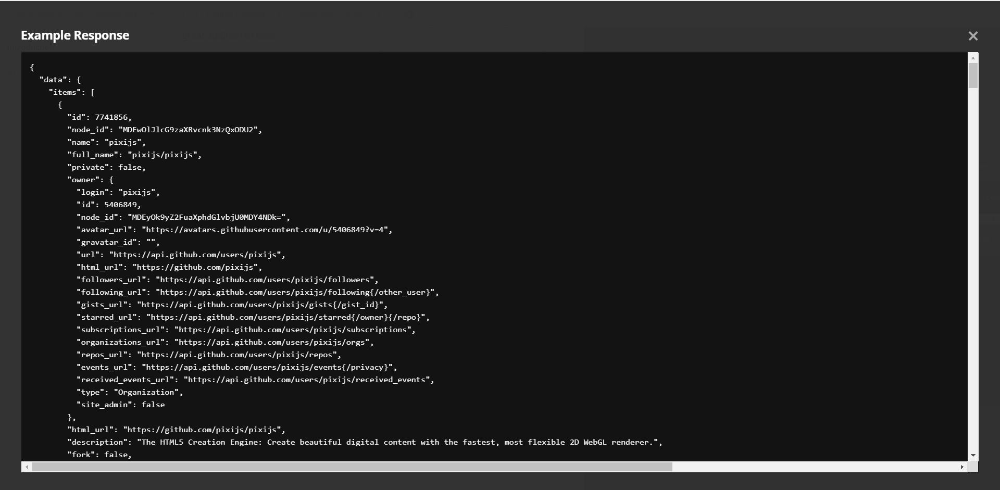

## Safa Task

#### Service Specification
**The service should be able to provide:** <br/>
• A list of the most popular repositories, sorted by number of stars.<br/>
• An option to be able to view the top 10, 50, 100 repositories should be available.<br/>
• Given a date, the most popular repositories created from this date onwards should
be returned.<br/>
• A filter for the programming language would be a great addition to have.<br/><br/>
#### Implementation Details
**GitHub provides a public search endpoint which you can use for fetching the most
popular repositories:**
[Github](https://api.github.com/search/repositories?q=created:>2019-01-10&sort=stars&order=desc)
But feel free to use any other endpoints, if you wish.
We will really value: concise and clean code, scalability and performance and testing.
Have fun!````

## Lumen PHP Framework

[](https://travis-ci.org/laravel/lumen-framework)
[](https://packagist.org/packages/laravel/lumen-framework)
[](https://packagist.org/packages/laravel/lumen-framework)
[](https://packagist.org/packages/laravel/lumen-framework)

Laravel Lumen is a stunningly fast PHP micro-framework for building web applications with expressive, elegant syntax. We believe development must be an enjoyable, creative experience to be truly fulfilling. Lumen attempts to take the pain out of development by easing common tasks used in the majority of web projects, such as routing, database abstraction, queueing, and caching.


## Tutorial 

##### 1. install composer of project composer install
##### 2. using postman document to guid you to apis: <br/>
https://documenter.getpostman.com/view/8316268/UV5deaej

## Coding

##### 1. Find core logic in "app/Safa" folder, wrote according to SOLID Principles.<br/>
##### 2. Find business logic in "app/Http/Controllers/Controller.php" file.<br/>

## Coding Description

##### 1. "app/Safa/Classes/Constants.php" responsible for define all const vals that we using in the system like: "GITHUB_URL"<br/>
##### 2. "app/Safa/Classes/RequestParse.php" responsible for getting and parse the response of "GITHUB_URL"<br/>

##### 3. "app/Safa/Resources/RequestResource.php" responsible for getting all parameter request<br/>
##### 4. "app/Safa/Validators/Validator.php": responsible for validating parameter inputs<br/>

##### 5. "app/Safa/Mappers/RepositoryMapper.php": this pattern responsible for display the elements of every object that you want and hidden other<br/>

## Postman Result ScreenShot

<p align="center">

</p>

## Tools
 
#### Programming Language: PHP 7.2 
#### Framework: Lumen 7.0
